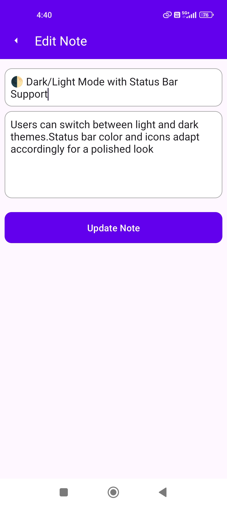

# Note-Taking App

A simple and efficient note-taking application built with **Kotlin**, **Room**, **Hilt/Dagger**, and **MVVM architecture**. This app allows users to create, edit, delete, and manage notes while supporting dark and light mode themes. 

## Features

- **CRUD Operations**: 
  - Create, Edit, and Delete notes with validation and error handling.
  
- **Wrapper Class**: 
  - Used to handle UI states (`Loading`, `Success`, `Error`) in a clean way with a `Resource<T>` wrapper class.

- **Dark/Light Mode Toggle**: 
  - Easily switch between dark and light themes. Preferences are saved using `SharedPreferences`.

- **Toolbar Menu**: 
  - Includes an "Add" button and a "Theme" toggle icon for theme switching.

- **Progress Bar**: 
  - A loading state indicator (ProgressBar) used during long-running tasks.

- **Swipe to Delete**: 
  - Swipe to delete a note with an undo option using `Snackbar`.

- **Form Validation**: 
  - Proper validation of user input when adding or editing a note.

- **Error Handling**: 
  - Includes error handling to ensure the app is stable under various scenarios (e.g., empty inputs or failed operations).

- **Testing**: 
  - Unit testing using **JUnit** to verify core functionalities.

## Architecture

This app follows the **MVVM** (Model-View-ViewModel) architecture to separate concerns and improve scalability and maintainability.

- **Model**: Represents the data layer, including Room entities for storing notes.
- **View**: The UI layer (activities/fragments) responsible for displaying data.
- **ViewModel**: Handles business logic and communicates between the UI and model layers.

## Libraries Used

- **Room**: For local database persistence.
- **Hilt/Dagger**: For dependency injection (DI).
- **LiveData** / **ViewModel**: For observing data changes in a lifecycle-aware manner.
- **JUnit**: For unit testing.

## Screenshots

<table>
  <tr>
    <td style="text-align: center;"> Note List</td>
    <td style="text-align: center;"> Add</td>
    <td style="text-align: center;"> Dark/Light Mode toggle</td>
    <td style="text-align: center;"> Snack bar</td>
    <td style="text-align: center;"> Edit</td>
    <td style="text-align: center;"> Delete</td>
  </tr>
</table>

## Installation

To get started, clone the repository:

git clone https://github.com/MeteorBlitz/note-taking-app.git

